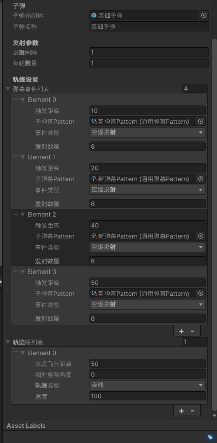
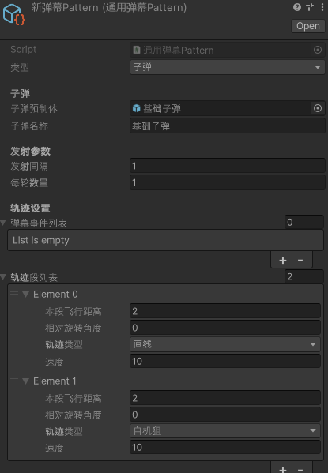
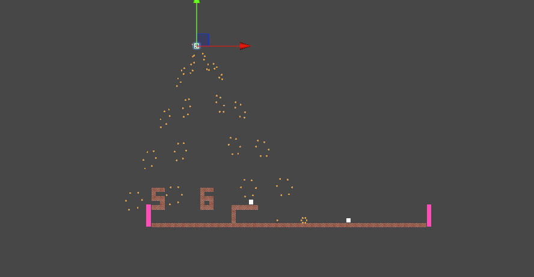

# Unity 2D 弹幕系统 Demo
> 基于Unity实现**数据驱动**弹幕射击核心系统，以ScriptableObject配置驱动实体子弹与激光，附带激光模块实现判定逻辑与渲染解耦。

## 演示视频
数据驱动的弹幕实体系统演示(点击查看)：

## 项目简介
本项目核心是一套**数据驱动的弹幕实体系统**，使用 ScriptableObject 制作弹幕 Pattern 配置资产。
所有子弹、激光的行为参数全部剥离到配置文件，新增弹幕/攻击样式，不需要修改核心管理器代码。
子弹与激光作为独立运行实例管理：子弹采用 Unity Physics2D 触发器做命中检测；激光模块实现判定逻辑与渲染显示解耦，渲染对象仅做可视化，不参与碰撞与伤害计算。
支持旋转激光、长条矩形激光；批量激光场景使用对象池降低 GC 开销。

这套**数据驱动 Pattern 的开发范式具备很强通用性**，并不局限于弹幕射击游戏。
核心思路：将实体行为、属性参数抽离为独立配置资产，运行时读取配置生成运行实例。
该思路可以迁移到动作游戏技能系统、塔防怪物/炮台配置、割草游戏攻击效果、BOSS 行为配置等各类游戏模块。

项目同时附带游戏基础配套模块：存档系统、敌人 AI、UGUI 游戏界面、Tilemap 地图、额外关卡玩法。

## 核心功能

1. **数据驱动弹幕 Pattern**
   使用 ScriptableObject 存储子弹、激光的全部参数，策划可直接在编辑器内配置。新增弹幕样式无需修改核心管理器代码。
2. 实体子弹：支持发射、位移、生命周期、边界自动销毁，全部行为由 Pattern 配置驱动，命中检测采用 Physics2D 触发器。
3. 激光系统
   - 支持直线矩形激光、钢铁实心圆激光、月环激光
   - 支持激光持续时间、预览时间、颜色、宽度、长度、半径、旋转速度和发射方向配置
   - 普通激光发射前可显示预警，预警结束后才开始造成伤害
   - 激光预览与正式激光使用不同颜色，可清晰区分预警阶段和伤害阶段
   - 点到线段距离平方命中判定，全程避免开方，优化计算性能
   - 激光逻辑实例和渲染对象解耦，渲染对象只负责显示，不参与碰撞与伤害计算
   - 支持通过对象池复用激光渲染预制体
4. 对象池：复用激光渲染预制体，减少 Instantiate/Destroy，解决网格切割批量激光产生的 GC 尖峰
5. 分层碰撞判定：子弹使用 Unity Physics2D 触发器；激光模块手写几何数学判定，不依赖 Unity 物理引擎，可控性强
6. Boss 行为与特效系统
   - 使用行为段和配置列表控制 Boss 的等待、动作、发射轮数、首轮延迟和发射间隔
   - 统一支持实体子弹、激光和特效 Pattern
   - 推拉玩家特效：以多个作用点为中心，将玩家推离或拉向指定位置，并支持预览时间、推拉距离、速度限制和阻尼
   - 动静剑特效：要求玩家在指定持续时间内移动或保持绝对静止，违反要求时受到伤害
   - 预知未来特效：按激光 Pattern 列表顺序依次预览后续攻击，预览全部完成后按相同顺序正式释放激光

## 附加模块

- 存档系统：Json 序列化实现游戏进度持久化，包含存档合法性校验，防止损坏存档导致程序崩溃，支持快速存档和自定义档位存档
- 对象池：复用渲染预制体，减少 Instantiate/Destroy，解决批量生成对象产生的 GC 尖峰
- 基础敌人 AI：敌人巡逻、追踪玩家行为逻辑
- UGUI 游戏界面：暂停菜单，存档页面，设置页面
- Tilemap：2D 场景地图搭建
- 关卡玩法：除开弹幕系统，每章都有一个独特的章节玩法

## 架构设计

核心思想：**数据驱动 Pattern，配置驱动实体行为；激光模块附加逻辑渲染分离设计**

1. Pattern 配置资产：ScriptableObject，定义每一类实体的行为参数（速度、持续时间、宽度、转速等）
2. 子弹实例：挂载在 GameObject 弹幕实体上，读取 Pattern 配置，自身独立维护生命周期、位移；命中检测依赖 Physics2D 触发器，每帧自主执行更新
3. 激光运行实例：纯 C# 普通类，**不挂载 GameObject**，只负责坐标、角度、生命周期、几何命中的纯计算
4. 渲染视图层（仅激光模块使用）：LineRenderer/SpriteRenderer，由激光逻辑实例驱动更新显示；对象池统一管理渲染对象，销毁时归还池内
5. 行为脚本：负责读取行为段和 Pattern 的发射配置，并将每次具体的发射位置、发射方向和 Pattern 传递给行为调度器
6. 行为调度器：负责执行单次子弹、激光或特效发射，不负责解析 Pattern 内部的发射位置列表
7. 激光预览实例：独立于正式激光运行实例，只负责显示预警效果，不执行伤害判定
8. 特效 Pattern：以独立 ScriptableObject 表达不同攻击逻辑，避免将推拉、动静判定和预知未来混入通用激光逻辑

> 激光逻辑：每帧更新原点与旋转角度，使用点到线段距离平方做玩家命中检测；渲染对象只是可视化表现。
> 数据驱动模式的通用性：这套 “配置资产定义行为，实体读取配置自主执行逻辑” 的开发范式，是游戏项目里非常通用的方案。
> 例如动作游戏技能系统：每个技能做成一份 ScriptableObject 配置，填写伤害、持续时间、形状、冷却，新增技能不用改动主干代码；塔防、BOSS 行为配置都可以复用这套思路。

## 技术亮点

1. **数据驱动实体系统**：基于 ScriptableObject 实现 Pattern 配置，实体行为由配置驱动。新增攻击实体仅需要新增配置，不用改动管理器主干代码。这套范式可迁移到技能、怪物、BOSS 行为等各类游戏子系统，不限于弹幕。
2. **激光模块：判定、运行与渲染解耦**：激光运行实例负责生命周期、旋转和几何命中判定；激光预览实例只负责预警显示，不执行伤害；LineRenderer、SpriteRenderer 等渲染对象通过统一接口更新，并由对象池复用。
3. **数学性能优化**：距离比较全部使用距离平方，规避 Mathf.Sqrt 开方开销；利用向量点积完成投影计算，实现点到线段最短距离求解
4. **对象池优化**：分片生成，含有最大容量限制，针对批量生成，减少 GC，避免卡顿尖峰
5. **分层碰撞方案**：子弹使用引擎触发器快速检测；激光手写几何碰撞判定，不依赖物理引擎，命中规则完全自主可控
6. **激光预警与伤害时序分离**：普通激光发射前先显示预警效果，预览阶段只负责渲染，不执行伤害判定；预览结束后再创建正式激光实例，明确区分警告阶段与伤害阶段。
7. **激光预览与正式激光复用同一配置**：预览和正式激光共享激光形状、位置、方向、尺寸与旋转参数，仅通过不同运行实例和显示颜色区分，避免重复维护两套攻击配置。
8. **多形状激光统一显示接口**：直线激光、钢铁激光和月环激光通过统一的 `I激光显示` 接口更新显示，激光运行逻辑无需关心具体渲染组件，实现显示层可替换。
9. **Boss 行为段时序调度**：通过行为段、配置列表、首轮延迟、发射间隔和发射轮数控制 Boss 攻击流程，支持在同一行为段中混合执行子弹、激光和特效。
10. **预知未来攻击编排**：预知未来由行为脚本按激光 Pattern 列表顺序组织预览和正式发射；行为调度器只处理单次发射的位置、方向和 Pattern，职责边界清晰。
11. **多种特效独立实现**：推拉玩家、动静剑和预知未来分别使用独立 Pattern 与执行逻辑，在统一行为调度入口下保持各自的实现方式，避免将不同机制强行耦合到通用特效中。
12. **推拉运动解析计算与速度限制**：推拉玩家使用恒力与线性阻尼运动模型计算施力时间和滑行时间，并对推拉期间的玩家速度进行上限约束，保证运动结果可控。

## 开发环境

- Unity 版本：2022.LTS
- 渲染管线：Built-in

## 开发日志

[开发日志.txt](Assets/text/开发日志.txt)

## 快速运行

1. 下载仓库到本地
2. Unity 打开项目，打开 Demo 场景
3. 进入 Play 模式，通过按键发射不同弹幕与激光
4. 控制玩家角色移动，与弹幕、激光进行碰撞测试

## 截图

## 后续计划
- 开发编辑器预览工具，在编辑模式直接预览弹幕、激光和特效效果
- 接入 Profiler 性能面板，实时监控弹幕、激光和特效实例数量与性能开销
- 完善激光预览效果，包括透明度、闪烁和渐变等视觉表现
- 扩展预知未来，使其支持更多类型的特效预览
- 增加更详细的 Pattern 校验和编辑器提示